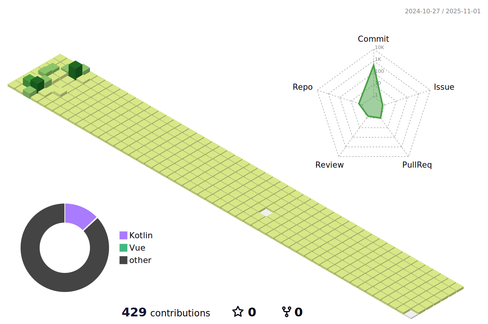

### 😊 Hi, I’m Soyeon Lee 😊

  <h5>📖충북대학교 사회교육과</h5>
  <h5>💻삼성 청년 SW 아카데미 11th 비전공 자바</h5>

 

#### 🛠️ Tech Stack 🛠️

      </a>&nbsp
      </a>&nbsp
      </a>
     
      </a>
      </a>
      </a>
      </a>
      </a>
     
      </a>&nbsp
      </a>&nbsp
      </a>&nbsp
       
      </a>&nbsp
      </a>&nbsp
      </a>&nbsp
     
      
       
      
  

<!-- - 💞️ 
- 📫 
- 😄 
- ⚡ -->
 

#### ✨ solved.ac ✨

<!---
lso401/lso401 is a ✨ special ✨ repository because its `README.md` (this file) appears on your GitHub profile.
You can click the Preview link to take a look at your changes.
--->

